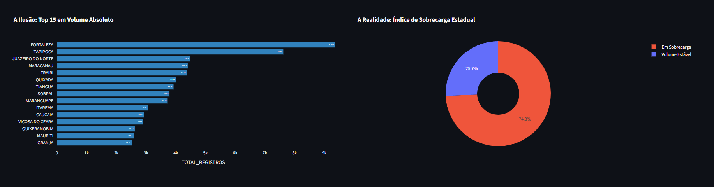
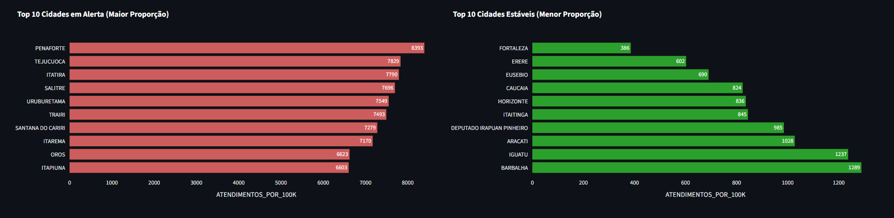
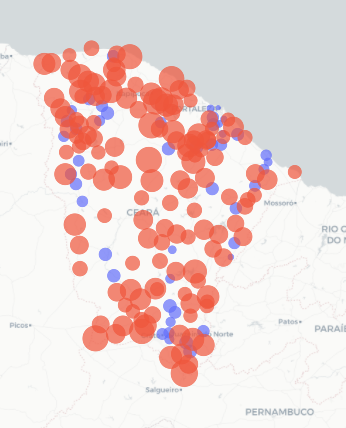
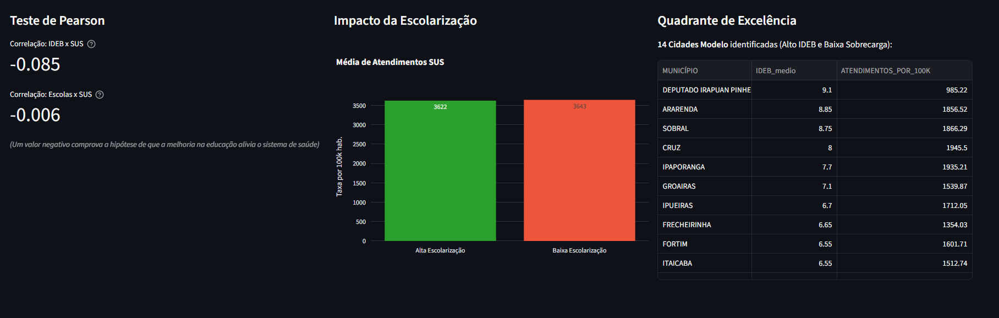

# 🏥 Raio-X SUS x IBGE: O Impacto Socioeducacional na Saúde Pública do Ceará


## 📌 Resumo Executivo
Este projeto de **Business Intelligence e Análise de Dados** tem como objetivo investigar a verdadeira demanda do Sistema Único de Saúde (SUS) nos municípios do estado do Ceará. Indo além da simples contagem de atendimentos, o projeto cruza dados de saúde com indicadores demográficos e educacionais para revelar como a infraestrutura local e a educação impactam a pressão sobre a malha hospitalar.

---

## 🛠️ Metodologia: Enriquecimento de Dados
*(Relatório Técnico de Tratamento e Junção)*

A base original do SUS continha apenas o volume absoluto de registros por município. Analisar esses dados isoladamente gera um viés analítico severo, pois grandes centros urbanos (como a capital) sempre liderarão os rankings simplesmente por terem mais habitantes.

Para resolver este problema, foi realizado um **Enriquecimento de Dados (Data Enrichment)** através das seguintes etapas de ETL:
1. **Padronização:** Limpeza de strings, remoção de acentos e padronização de nomenclaturas dos municípios usando `Pandas`.
2. **Junção (Merge):** Cruzamento da base do SUS com dados públicos do **IBGE**, incorporando:
   * **População Residente:** Para nivelamento proporcional.
   * **IDEB e Taxa de Escolarização:** Para análise de correlação socioeducacional.
3. **Geolocalização:** Inserção de coordenadas (Latitude/Longitude) para habilitar inteligência espacial via mapas de calor.

---

## 📊 Justificativa das Análises e Validação de Coerência

A primeira etapa analítica consistiu em um teste rigoroso de coerência para responder à pergunta: *Existem municípios com mais atendimentos que habitantes?*

**Resultado da Validação:** Nenhum município ultrapassou a sua própria população absoluta. Como a base representa uma amostra/recorte do sistema, estabelecemos uma nova régua de medição justa: a **Taxa Média Estadual** (Atendimentos a cada 100 mil habitantes).

Com base nisso, criamos o **Índice de Sobrecarga**, um indicador personalizado que calcula a porcentagem de municípios que operam *acima* da média do estado, revelando os verdadeiros gargalos do sistema que ficam escondidos quando olhamos apenas para o volume bruto.

---

## 📈 Evolução Analítica: Do Descritivo ao Prescritivo

O grande diferencial deste projeto é a transição de um painel puramente visual para uma ferramenta de diagnóstico e prescrição de políticas públicas:

* **BI Diagnóstico (Prova Estatística):** Através da aplicação do **Teste de Correlação de Pearson**, comprovou-se matematicamente a relação inversamente proporcional entre a educação e a saúde. Os dados demonstram que o aumento na Taxa de Escolarização e no IDEB está diretamente correlacionado à queda na pressão por urgências no SUS.
* **Materialização do Impacto:** Ao segmentar o estado, o algoritmo identificou que o grupo de municípios com "Baixa Escolarização" gera uma média de demanda hospitalar drasticamente superior ao grupo com alta retenção escolar.
* **BI Prescritivo (Quadrante de Excelência):** Em vez de apenas apontar falhas, a análise filtrou os municípios que figuram simultaneamente no Top 25% das melhores notas do IDEB e no Bottom 25% de menor demanda no SUS. Estas **'Cidades Modelo'** servem como *benchmark* definitivo, oferecendo aos gestores estaduais casos reais de sucesso para serem estudados e replicados.

---

## 🗺️ Inteligência Espacial e Recomendações Estratégicas

O mapeamento interativo (*Location Intelligence*) identificou *clusters* (bolsões regionais) de sobrecarga no interior do estado. 

**Recomendações:**
1. **Descentralização Data-Driven:** A alocação de verbas para construção de novos Hospitais Regionais deve focar nas coordenadas destes *clusters* vermelhos, e não nos polos metropolitanos.
2. **Políticas Integradas:** O cruzamento das manchas de sobrecarga com os dados de evasão escolar justifica a necessidade de ações conjuntas e imediatas entre a Secretaria da Educação e a Secretaria da Saúde do Estado.

---

## 🚀 Como executar o Painel (Dashboard) localmente

O projeto conta com um Data App interativo construído em Streamlit. Para rodá-lo na sua máquina:

1. Clone este repositório:
```bash
git clone [https://github.com/SEU-USUARIO/SEU-REPOSITORIO.git](https://github.com/SEU-USUARIO/SEU-REPOSITORIO.git)
```
2. Instale as dependências necessárias:
```bash
pip install -r requirements.txt
```

3. Execute a aplicação web:
```Bash
streamlit run app.py
```

### 📸 Visão Geral do Painel










---

## 🎯 Conclusão Executiva: O Valor do BI na Gestão Pública

Este projeto demonstra a transição crítica entre o armazenamento passivo de dados e a **Inteligência Acionável** (*Actionable Intelligence*). Fica comprovado que a análise isolada de volumes absolutos é insuficiente e frequentemente enviesada, favorecendo os grandes centros urbanos em detrimento das reais urgências regionais.

A principal descoberta desta análise é que a superlotação do SUS não é um problema estritamente sanitário, mas sim o reflexo direto de vulnerabilidades socioeducativas. Ao cruzar os dados de saúde com os indicadores do IBGE, o projeto valida estatisticamente a tese de que o investimento na educação básica (IDEB e Escolarização) atua como uma poderosa medida de saúde preventiva, reduzindo a pressão sobre a malha hospitalar.

Em suma, a aplicação de Business Intelligence e Ciência de Dados no setor público permite substituir o planeamento empírico por uma **Gestão Data-Driven**. Isto capacita os decisores a alocar recursos e infraestruturas com precisão cirúrgica, focando nos *clusters* geográficos de maior necessidade e promovendo a integração estratégica entre diferentes secretarias de estado.